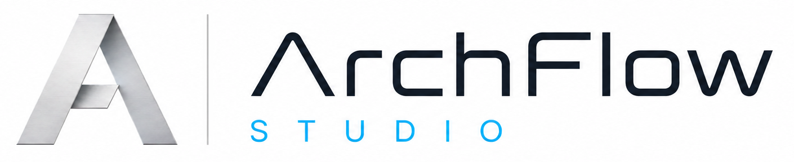
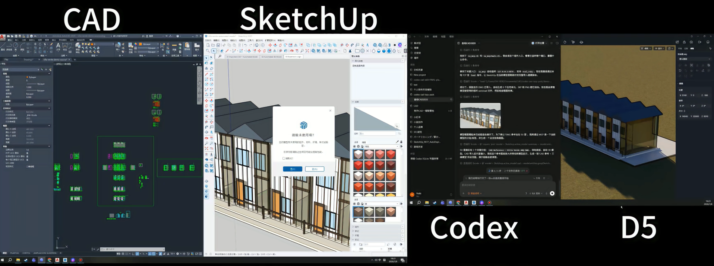
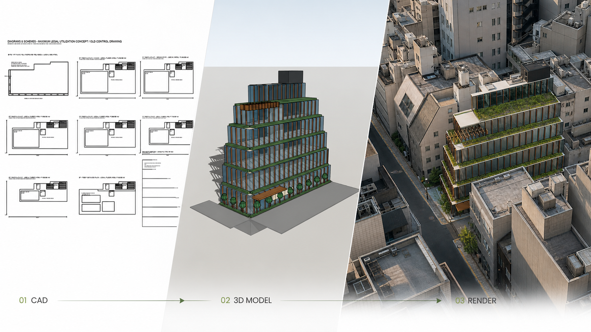

<p align="center">
  
</p>

# ArchFlow Studio

<p align="center">
  <strong>Traceable automation for architectural CAD, SketchUp modeling, regulatory evidence, and concept visualization.</strong>
</p>

<p align="center">
  <a href="https://archflow.best">Official website</a> · Developer: OHDESIGN · Xiaohongshu: @heikikun
</p>

> [!WARNING]
> ArchFlow Studio is currently an unsigned Developer Preview. Compatibility may vary across CAD and SketchUp versions. Every architectural, regulatory, structural, fire-safety, accessibility, and construction-related output must be reviewed by qualified professionals.

## Overview

ArchFlow Studio is an open-source orchestration layer for architectural concept and preliminary design workflows. It connects design requirements, site CAD data, sourced regulatory evidence, a semantic building model, CAD output, SketchUp model generation, view capture, and AI-assisted concept rendering in one traceable pipeline controlled from Codex.

The distributable Codex Plugin is located in [`plugins/archflow-studio`](plugins/archflow-studio). Its unified Skill combines CAD connectivity, SketchUp Bridge deployment, architectural generation, workstation configuration, regulatory evidence handling, and render handoff without requiring users to install several unrelated Skills.

The central design principle is simple: `building_model.json` is the single source of truth. AI extracts and coordinates draft information, deterministic scripts validate and generate artifacts, and qualified professionals retain final responsibility for every design and compliance decision.

## Workflow at a glance



Codex acts as the orchestration interface between CAD, SketchUp, and downstream visualization tools. Design information can move from two-dimensional source drawings to a coordinated semantic model and presentation workflow while preserving project records, input fingerprints, and review gates. Available integrations depend on installed software, Bridge configuration, and user authorization.

## From site constraints to visualization



This example shows the intended project delivery path: investigate site and regulatory constraints in CAD, develop a coordinated three-dimensional design, then generate presentation imagery from the approved model view. The rendering stage is a concept-visualization handoff and does not replace technical verification or construction documentation.

## What works today

- Check whether the bundled ArchFlow CAD Bridge, SketchUp Bridge, and architectural generation pipeline are ready.
- Validate portable `archflow.project.json` project packages.
- Convert requirement text into a reviewable `parsed_requirements.yaml` draft.
- Generate immutable run directories from `building_model.json`, including validation reports, metrics, semantic DXF, SketchUp Ruby, standard-view data, and human-review reports.
- After SketchUp modeling, capture the current camera or a standard view as PNG and prepare a geometry-preserving concept-render job in the architectural style selected by the user.
- Keep source CAD read-only by default and require explicit authorization before model-changing operations.
- Mark unverified regulatory values and avoid claiming that generated content is compliant, construction-ready, or professionally approved.

## Quick start

Run directly from the repository without installing the package:

```powershell
$env:PYTHONPATH = "$PWD/src"
python -m archflow doctor --json
python -m archflow check examples/detached-house/archflow.project.json
python -m archflow run examples/detached-house/archflow.project.json --stage build --plan
python -m archflow run examples/detached-house/archflow.project.json --stage build
python -m archflow status examples/detached-house/archflow.project.json
```

Preview the unified Skill's workstation configuration before applying it:

```powershell
powershell -ExecutionPolicy Bypass -File plugins\archflow-studio\skills\archflow-studio\scripts\setup_workstation.ps1
powershell -ExecutionPolicy Bypass -File plugins\archflow-studio\skills\archflow-studio\scripts\setup_workstation.ps1 -Apply
```

For an editable development installation:

```powershell
python -m pip install -e .
archflow doctor
```

Create a new project package:

```powershell
archflow init C:\projects\my-house --title "My House" --mode preliminary
```

## Developer Preview package

Build the current Windows Developer Preview:

```powershell
powershell -ExecutionPolicy Bypass -File installer\windows\build_release.ps1
```

After extracting the package, inspect the deployment plan before installation:

```powershell
powershell -ExecutionPolicy Bypass -File .\ArchFlow.Setup.ps1 -Action Plan
powershell -ExecutionPolicy Bypass -File .\ArchFlow.Setup.ps1 -Action Install
```

Add `-ConfigureApplications` only when you explicitly want the installer to configure the detected CAD and SketchUp applications.

## Architecture

1. **ArchFlow CAD Bridge** — inspects DWG/DXF context in read-only mode, exports structured CAD information, and runs CAD commands only after explicit authorization.
2. **ArchFlow Design Core** — maintains the semantic model contract, validates geometry and metrics, and generates DXF, Ruby, view, render-handoff, and review artifacts.
3. **ArchFlow Orchestrator** — manages project packages, input fingerprints, immutable run records, approval gates, and end-to-end execution.

See [the architecture documentation](docs/architecture.md), [the roadmap](docs/roadmap.md), and [the distribution model](docs/distribution.md) for implementation and release details.

## Safety and professional responsibility

All outputs must be labeled `concept`, `preliminary`, or `construction_assistance`. Any regulatory value that is not bound to an authoritative source, version, jurisdiction, and clause remains `UNVERIFIED`. Generated SketchUp Ruby is an artifact, not an instruction to execute automatically; users should run it only in a blank or duplicated model after review.

ArchFlow Studio assists a professional workflow. It does not replace licensed designers, architects, engineers, code consultants, contractors, or authorities having jurisdiction.

## License and media

Source code is licensed under [Apache License 2.0](LICENSE). Third-party components and distribution restrictions are documented in [THIRD_PARTY_NOTICES.md](THIRD_PARTY_NOTICES.md).

The ArchFlow name, logo, and project showcase images are © OHDESIGN and are not included in the Apache-2.0 license grant unless explicitly stated otherwise. See the [media notice](docs/assets/README.md).
